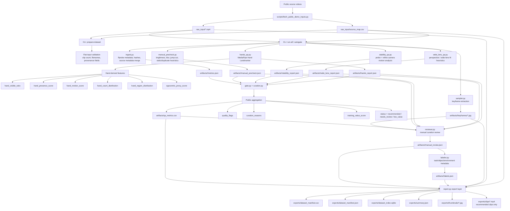

# Sieve Egocentric QA Pipeline Demo

This repo demonstrates a public-data video curation workflow:

`raw video -> scored/indexed/reviewed/exported training dataset`

The existing video-processing modules are preserved and repurposed as a compact dataset-curation pipeline:

- `ffprobe` ingest and metadata indexing
- MediaPipe hand tracking with hand-derived egocentric features
- blur, brightness, motion, stability, and static/duplicate heuristics
- score aggregation into `training_value_score`
- manual review plus optional labeling
- dataset manifest, JSON export, SQLite index, thumbnails, and clip export

## Repository Layout

The runnable code is split by responsibility:

- `backend/` - Python pipeline source
- `src/` - React frontend
- `vite.config.ts` - local Vite runtime bridge for dataset runs and uploads during dev
- `run_dataset_demo.py` - Python CLI wrapper into `backend.cli`
- `config/default.yaml` - public thresholds and heuristic weights

The main Python CLI entrypoint is:

```bash
python run_dataset_demo.py show-config
```

## Technical Flow



## Setup

Use Python 3.11+. The current codebase already relies on 3.10+ syntax, and the demo is validated on 3.11.

```bash
python3.11 -m venv .venv
. .venv/bin/activate
pip install -r requirements.txt
```

## Quickstart

Clone the repo, create the Python environment, install dependencies, and run the pipeline on a folder of videos.

```bash
python3.11 -m venv .venv
. .venv/bin/activate
pip install -r requirements.txt
python run_dataset_demo.py show-config
python run_dataset_demo.py run-all -i /absolute/path/to/videos --snapshot-output-dir exports
```

If you want to test a single video file, put it in its own folder first, then point `-i` at that folder.

That produces:

- `artifacts/` - per-clip analysis artifacts
- `exports/dataset_manifest.csv`
- `exports/dataset_manifest.json`
- `exports/dataset_index.sqlite`
- `exports/summary.json`

## Demo Frontend

A lightweight Vite + React viewer is included for a 60-second read-only demo of the exported artifacts.

It reads directly from the static files in `exports/`:

- `exports/summary.json`
- `exports/dataset_manifest.json`
- `exports/thumbnails/*`
- `exports/clips/*`

Run it locally:

```bash
npm install
npm run dev
```

Build the static viewer:

```bash
npm run build
```

The frontend reads from `exports/` and uses a local Vite dev bridge for folder runs and uploads during development.

## Outputs

The public export surface is:

```text
exports/
  clips/
  thumbnails/
  dataset_manifest.csv
  dataset_manifest.json
  dataset_index.sqlite
  summary.json
```

`dataset_manifest.*` includes one row per analyzed clip with:

- `status`: `recommended`, `needs_review`, or `low_value`
- `training_value_score`
- `quality_flags`
- `curation_reasons`
- hand-derived egocentric features
- quality/stability heuristics
- provenance and `demo_category`
- optional manual labels

`dataset_index.sqlite` mirrors the manifest in a queryable form and adds indexes for `status`, `training_value_score`, `quality_flags`, `curation_reasons`, and `demo_category`.

## Heuristic Scoring

Thresholds and weights live in [`config/default.yaml`](/Users/lucas/Desktop/Sieve2/config/default.yaml). They are public heuristic defaults tuned for demo use on public or self-recorded clips.

The current score combines:

- `hand_visible_ratio`
- `hand_presence_score`
- `hand_motion_score`
- `egocentric_proxy_score`
- `brightness_score`
- `blur_score`
- `motion_score`
- `camera_stability_score`
- `static_duplicate_score`
