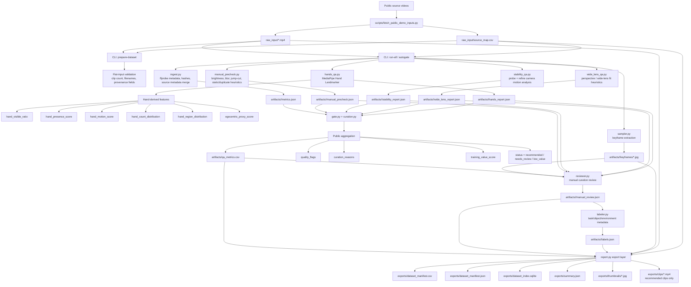

# Sieve Egocentric QA Pipeline Demo

This repo demonstrates a public-data video curation workflow:

`raw video -> scored/indexed/reviewed/exported training dataset`

The existing video-processing modules are preserved and repurposed as a compact dataset-curation pipeline:

- `ffprobe` ingest and metadata indexing
- MediaPipe hand tracking with hand-derived egocentric features
- blur, brightness, motion, stability, and static/duplicate heuristics
- score aggregation into `training_value_score`
- manual review plus optional labeling
- dataset manifest, JSON export, SQLite index, thumbnails, and clip export

## Technical Flow



## Setup

Use Python 3.11+. The current codebase already relies on 3.10+ syntax, and the demo is validated on 3.11.

```bash
python3.11 -m venv .venv
. .venv/bin/activate
pip install -r requirements.txt
```

The MediaPipe hand model downloads automatically on first hand-analysis run if `models/hand_landmarker.task` is missing.

## Fetch Public Demo Inputs

The demo input set is a flat `raw_input/` directory plus `raw_input/source_map.csv`.

```bash
.venv/bin/python scripts/fetch_public_demo_inputs.py
```

The fetch script pulls public videos from Wikimedia Commons, cuts them into shorter demo clips, and writes clip provenance and `demo_category` metadata into the sidecar CSV.

## Run The Demo

```bash
bash demo.sh
```

Or step-by-step:

```bash
.venv/bin/python run_dataset_demo.py show-config
.venv/bin/python run_dataset_demo.py prepare-dataset --input-dir raw_input --expected-count 10
.venv/bin/python run_dataset_demo.py run-all -i raw_input -n 10 --snapshot-output-dir exports
.venv/bin/python run_dataset_demo.py export -o exports -n 10
```

Manual review and labeling remain available when you want to override or enrich the automated results:

```bash
.venv/bin/python run_dataset_demo.py review --input-dir raw_input --output-dir exports
.venv/bin/python run_dataset_demo.py label --output-dir exports
```

## Outputs

The public export surface is:

```text
exports/
  clips/
  thumbnails/
  dataset_manifest.csv
  dataset_manifest.json
  dataset_index.sqlite
  summary.json
```

`dataset_manifest.*` includes one row per analyzed clip with:

- `status`: `recommended`, `needs_review`, or `low_value`
- `training_value_score`
- `quality_flags`
- `curation_reasons`
- hand-derived egocentric features
- quality/stability heuristics
- provenance and `demo_category`
- optional manual labels

`dataset_index.sqlite` mirrors the manifest in a queryable form and adds indexes for `status`, `training_value_score`, `quality_flags`, `curation_reasons`, and `demo_category`.

## Heuristic Scoring

Thresholds and weights live in [`config/default.yaml`](/Users/lucas/Desktop/Sieve2/config/default.yaml). They are public heuristic defaults tuned for demo use on public or self-recorded clips, not confidential rubric values.

The current score combines:

- `hand_visible_ratio`
- `hand_presence_score`
- `hand_motion_score`
- `egocentric_proxy_score`
- `brightness_score`
- `blur_score`
- `motion_score`
- `camera_stability_score`
- `static_duplicate_score`

## Notes

- MediaPipe is the required hand-tracking backend in this demo.
- The existing manual labeling surface is kept as the action/object metadata layer; no new action-recognition model is introduced.
- The pipeline still emits the original internal artifacts under `artifacts/`, but the public-facing demo surface is the `exports/` directory.
